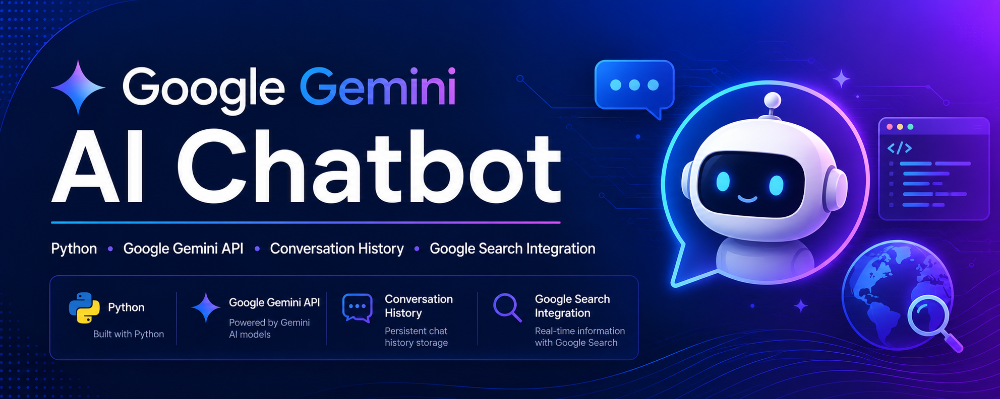

<p align="center">
  
</p>

# Google Gemini AI Chatbot

A Python-based AI chatbot built using the Google Gemini API. The chatbot supports conversation history and includes a modular Google Search component for future real-time search integration.

## 🚀 Features

- Google Gemini AI integration
- Conversation history support
- Modular chatbot design
- Google Search module
- Error handling for API responses
- Beginner-friendly Python code

## 🛠️ Technologies Used

- Python
- Requests
- Google Gemini API
- JSON

## 📂 Project Structure

```text
Gemini-AI-Chatbot/
├── banner.png
├── chatbot.py
├── config.py
├── search.py
├── chat_history.json
├── requirements.txt
├── .gitignore
├── LICENSE
└── README.md
